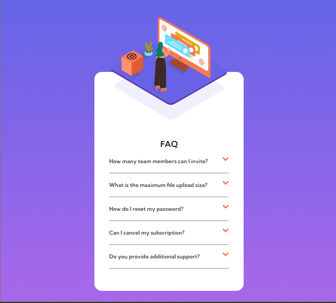

# Frontend Mentor - FAQ accordion card solution

This is a solution to the [FAQ accordion card challenge on Frontend Mentor](https://www.frontendmentor.io/challenges/faq-accordion-card-XlyjD0Oam). Frontend Mentor challenges help you improve your coding skills by building realistic projects.

## Table of contents

- [Overview](#overview)
  - [The challenge](#the-challenge)
  - [Screenshot](#screenshot)
  - [Links](#links)
- [My process](#my-process)
  - [Built with](#built-with)
  - [What I learned](#what-i-learned)
  - [Continued development](#continued-development)
  - [Useful resources](#useful-resources)
- [Author](#author)

## Overview

### The challenge

Users should be able to:

- View the optimal layout for the component depending on their device's screen size
- See hover states for all interactive elements on the page
- Hide/Show the answer to a question when the question is clicked

### Screenshot



### Links

- Solution URL: [Github Link](https://github.com/samoina/faq-accordion-card-JS)
- Live Site URL: [Netlify Link](samoina-faq-card-js.netlify.app)

## My process

### Built with

- Semantic HTML5 markup
- CSS custom properties
- Flexbox
- CSS Grid
- Mobile-first workflow

### What I learned

#### Centering an absolute positioned element

This challenge reminded me how to center an absolute position element using CSS, with the knowledge that absolute positioned elements are typically removed from the normal flow of the document. So I added a relative position to the parent container, in this case, the `main` element. I then moved it up from the top border of the parent using the property top, and adjusted the left and right to 0 before adding auto to the left and right margin setting. Here's the CSS code snippet.

```css
.main__image {
	height: 12rem;
	position: absolute;
	top: -25%;
	left: 0;
	right: 0;
	margin: 0 auto;
}
```

#### Using event delegation to flip the arrow and show the answer to the question.

With the way I have structured my code, my initial approach was to loop through the NodeList containing the immeadiate parent, and add an event listener to each at the point of iteration. I would then check if the targetted element has a class that contains the icon, and if so, loop through the Nodelist containing all the icons before toggling the class. This, however, did not work as expected as the click changed ALL of the icons. I then realized i shouldn't loop through the icons.

```js
let faqQues = document.querySelectorAll('.faq__ques'),
	faqIcons = document.querySelectorAll('.faq__icon');

faqQues.forEach((faq) => {
	faq.addEventListener('click', (ev) => {
		if (ev.target.classList.contains('faq__icon')) {
			faqIcons.forEach((faqIcon) => {
				faqIcon.classList.toggle('faq__icon--flip');
			});
		}
	});
});
```

So i adjusted my code and aded a single event listener to the main parent of all the divs (main). When a click event occurs, I use the .closest() method to traverse the element and its parents towards the document root until it finds a node that matches the specified selector. In my case (.faq--ques), and then used the query selector to get the specific icon in that specific element. I then toggle the class for functionality.

```js
let faqQues = document.querySelectorAll('.faq__ques'),
	mainFAQ = document.querySelector('.main__faq');

mainFAQ.addEventListener('click', (event) => {
	const faqIcon = event.target
		.closest('.faq__ques')
		.querySelector('.faq__icon');

	if (faqIcon) {
		faqIcon.classList.toggle('faq__icon--flip');
	}
});
```

#### Hiding previously active answers shown

The approach above proved to be a challenge of sorts because the page would span downwwards when the arrow is clicked in the multiple sections. I needed to modify my code so that I'd get rid of the active classes if any of them were selected. So I created a Nodelist of the icons and answers, and if in each iteration the specific icon/ answer was not equal to the one clicked, I would then hide that and flip the icon back upwards. Here's the JS code for my approach.

```js
let mainFAQ = document.querySelector('.main__faq');

mainFAQ.addEventListener('click', (event) => {
	const clickedIcon = event.target.closest('.faq__ques');
	const faqIcons = document.querySelectorAll('.faq__icon');
	const faqAnswers = document.querySelectorAll('.faq__answer');

	if (clickedIcon) {
		//this is for toggling the icon class for the clicked question
		const clickedIconElement = clickedIcon.querySelector('.faq__icon');
		clickedIconElement.classList.toggle('faq__icon--flip');

		//toggle the answer for visibility for the clicked question by getting the parent element two levels up
		const clickedAnswer =
			clickedIconElement.parentElement.parentElement.querySelector(
				'.faq__answer'
			);
		clickedAnswer.classList.toggle('faq__answer--show');

		// Remove the active status from the other answers and icons
		faqAnswers.forEach((answer) => {
			if (answer !== clickedAnswer) {
				answer.classList.remove('faq__answer--show');
			}
		});

		faqIcons.forEach((icon) => {
			if (icon !== clickedIconElement) {
				icon.classList.remove('faq__icon--flip');
			}
		});
	}
});
```

### Continued development

I am keen to repeat this project using ReactJS.

### Useful resources

- [Center an absolute element with CSS ](https://www.freecodecamp.org/news/how-to-center-an-absolute-positioned-element/) - This helped me to understand positioning and centering of absolute elements
- [CSS Tricks - Flip an Image](https://css-tricks.com/snippets/css/flip-an-image/)

## Author

- Website - [Samoina Lives](https://samoinalives.wordpress.com/)
- Frontend Mentor - [Samoina](https://www.frontendmentor.io/profile/samoina)
- Twitter - [Samoina](https://www.twitter.com/samoina)
